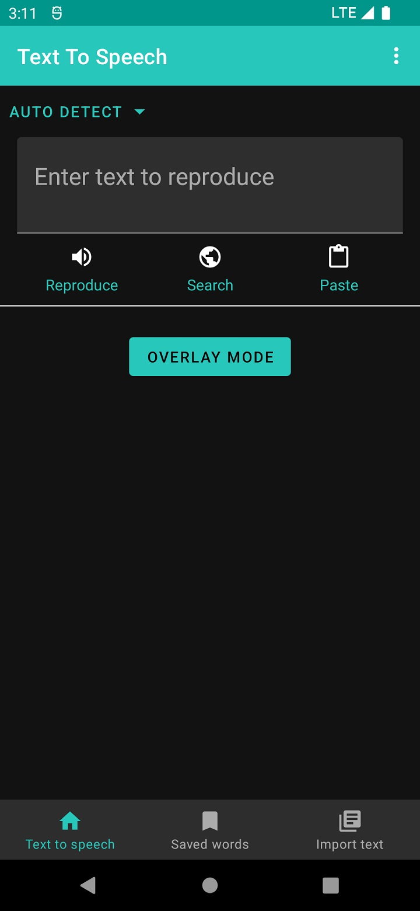
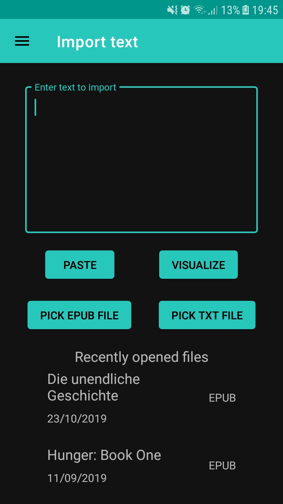
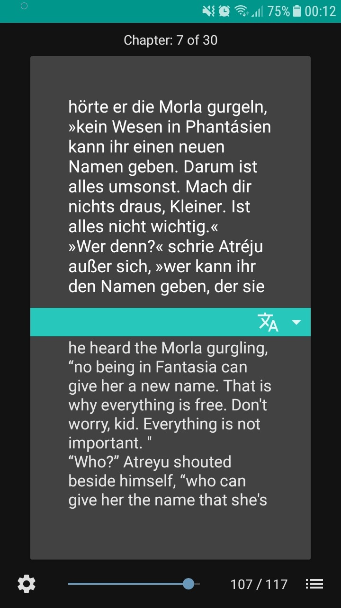

# Speakable
Speakable is a language learning Android application that allows you to enter or select words and reproduce them with Text to Speech. You can also save words, translate to different languages, search definitions, open EPUB/text files or web articles within the app.

# How to use

## Enter text
You can enter text or a link to a webpage in the main screen, multiple actions can be done with the input. You can also start other modes for use outside the main app.

## Get text information
You can use various features outside the app. When you highlight text, the shown toolbar has a TTS option that will show a dictionary definition (if available), the translation, and links to other resources.

<video src="https://github.com/user-attachments/assets/bdef117b-671d-49e9-a868-34ded4db2143" autoplay loop muted playsinline></video>

## Overlay mode

If you can't highlight text you can use overlay mode instead. When active, it shows a floating icon anywhere outside the app. Click on the icon and it shows a rectangle (similar to Windows' snipping tool) that you can drag and resize around the text you want to reproduce/translate.

<video src="https://github.com/user-attachments/assets/6cf645d5-271f-4d9a-9124-5d73ef6d08b9" autoplay loop muted playsinline></video>
## File viewer

Speakable includes a text viewer that allows you to use all the app features (such as TTS, text translation and definition) in an easier way.

You can either enter the text you want to view or import it from an external file like an epub and txt.

Inside the viewer you can click any word to see translation, definition and more! Or you can split the page and show a translated version.

## Web reader

Similar to the file viewer, you can also open web links within the app and enjoy all the features that make it easier to read pages in other languages.

<video src="https://github.com/user-attachments/assets/b75c80e6-91fc-40c6-9643-cf7a3cc72714" autoplay loop muted playsinline></video>

# How to install

You can download an APK of the latest release [here](https://github.com/memostark/Speakable/releases)
