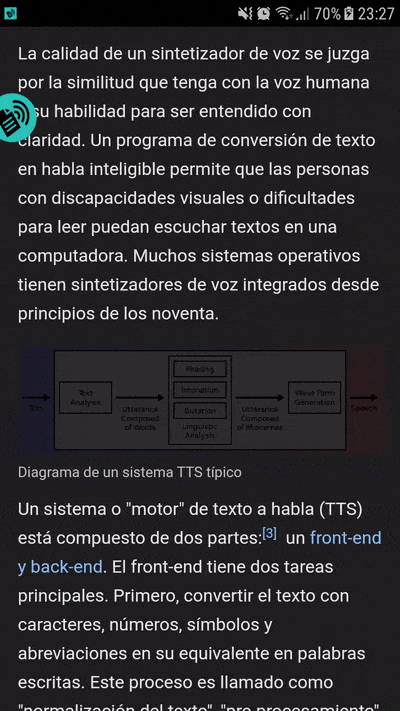
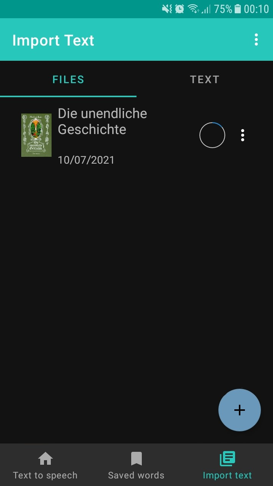

# Speakable (Text to Speech)
Speakable is a language learning android application that allows you to enter or select words and reproduce them with Text to Speech. You can also save words, translate to different languages, search definitions, open EPUB/text files or web articles within the app.

# How to use

## Enter text
You can enter text or a link to a webpage in the main screen, multiple action can be done with the input. You can also start other modes for use outside the main app.

## Get text information
You can use various features outside the app. When you highlight text, the shown toolbar has a TTS option that will show the Wiktionary definition (if available), the translation, and links to other resources.

 

1. Selected text
1. Detected language
1. Save word
1. Reproduce Text to Speech
1. Dictionary definition from Wiktionary
1. Translated text
1. Language to translate
1. Copy translation

You can also save words and additional notes with this dialog.

## Overlay mode

If you can't highlight text you can use overlay mode instead. When active, shows a floating icon anywhere outside the app. Click on the icon and it shows a rectangle (similar to Windows' snipping tool) that you can drag and resize around the text you want to reproduce/translate.

 
## File viewer

Speakable includes a text viewer that allows you to use all the app features (such as TTS, text translation and definition) in an easier way.

You can either enter the text you want to view or import it from an external file like an epub and txt.

Inside the viewer you can click any word to see translation, definition and more! Or you can split the page and show a translated version.

# How to install

You can download an APK of the latest release [here](https://github.com/memostark/Speakable/releases)
